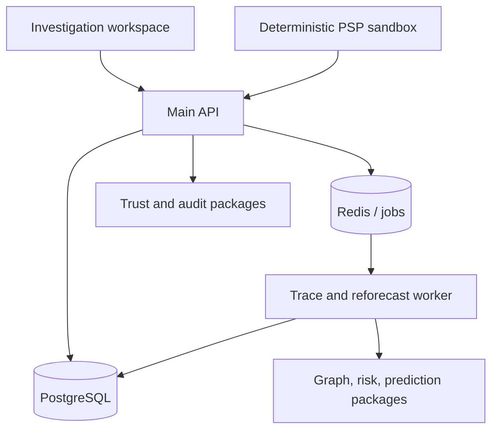

# Architecture

## Runtime applications

| Application        | Responsibility                             | Current state                                          |
| ------------------ | ------------------------------------------ | ------------------------------------------------------ |
| `apps/web`         | Command centre and investigation workspace | Graph, exposure, risk, exit-mode, and gate drill-down  |
| `apps/api`         | Validated, scoped HTTP boundary            | TRACE through independent forecast readiness           |
| `apps/worker`      | Trace/reforecast/alert job consumer        | Typed capability manifest                              |
| `apps/psp-sandbox` | Replaceable deterministic provider adapter | Golden scenario sequencing/reset with shared contracts |

## Shared packages

| Package        | Responsibility                                                                               |
| -------------- | -------------------------------------------------------------------------------------------- |
| `contracts`    | Zod schemas, enums, provider events, graph provenance, forecast responses, state transitions |
| `database`     | PostgreSQL migration metadata and core versioned schema                                      |
| `graph`        | Fraud-attributable exposure and bounded graph utilities                                      |
| `intelligence` | Explainable behavioural/network assessment without intent inference                          |
| `prediction`   | Exit-mode ranking and independent prediction/abstention rules                                |
| `trust`        | Credential validity, revocation, role, purpose, and identity-resolution abstractions         |
| `audit`        | Canonical evidence hashing, PII-free anchor-provider boundary, and development hashchain     |

## Integration boundary

The simulator emits the same `ProviderEvent` contract expected from a future authorised bank/FI adapter. It is deterministic, labelled `SIMULATED`, and resettable. The frontend consumes API state and never manufactures financial edges.

## Phase 3 persistence

`CaseService` depends on a repository port. Tests and lightweight local work can use the in-memory adapter. A configured API process uses `PostgresCaseRepository`, which persists cases, complaints, financial transactions, raw provider events, processed-event state, immutable graph snapshots, normalised graph nodes/edges, versioned exposure states, explainable mule assessments, exit-mode snapshots, independent Evidence Gate snapshots, and idempotency results. The same flow is tested across a repository/service recreation to prove restart persistence.

Exposure is recomputed only against the latest immutable graph. Risk requires current exposure, exit mode requires current exposure and risk for its account, and the gate requires current exit mode. A changed TRACE version invalidates current derived intelligence without deleting its history.

## Evidence-anchor boundary

The API hashes submitted JSON evidence before crossing the blockchain-provider boundary. The provider receives only the evidence digest, a derived submission digest, and an anchor timestamp. Case IDs, evidence references, account references, and raw evidence remain off-chain.

`EvidenceAnchorProvider` is replaceable. The bundled development hashchain is deterministic and suitable for local verification; it is not presented as a public-chain transaction. PostgreSQL stores the receipt and digest metadata, never the submitted evidence body. Verification independently checks both the supplied payload hash and the provider receipt.
