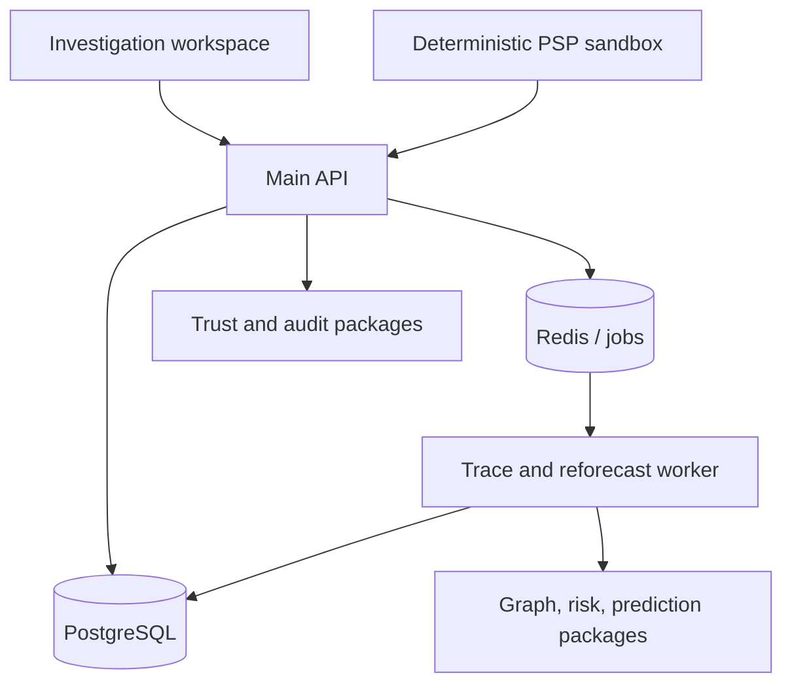

# Architecture

## Runtime applications

| Application        | Responsibility                             | Current state                                            |
| ------------------ | ------------------------------------------ | -------------------------------------------------------- |
| `apps/web`         | Command centre and investigation workspace | Graph, exposure, risk drill-down, and demo orchestration |
| `apps/api`         | Validated, scoped HTTP boundary            | Complaint, ledger, TRACE, exposure, and account risk     |
| `apps/worker`      | Trace/reforecast/alert job consumer        | Typed capability manifest                                |
| `apps/psp-sandbox` | Replaceable deterministic provider adapter | Golden scenario sequencing/reset with shared contracts   |

## Shared packages

| Package        | Responsibility                                                                               |
| -------------- | -------------------------------------------------------------------------------------------- |
| `contracts`    | Zod schemas, enums, provider events, graph provenance, forecast responses, state transitions |
| `database`     | PostgreSQL migration metadata and core versioned schema                                      |
| `graph`        | Fraud-attributable exposure and bounded graph utilities                                      |
| `intelligence` | Explainable behavioural/network assessment without intent inference                          |
| `prediction`   | Evidence Gate and prediction/abstention contracts                                            |
| `trust`        | Credential validity, revocation, role, purpose, and identity-resolution abstractions         |
| `audit`        | Canonical evidence hashing and future anchor-provider interface                              |

## Integration boundary

The simulator emits the same `ProviderEvent` contract expected from a future authorised bank/FI adapter. It is deterministic, labelled `SIMULATED`, and resettable. The frontend consumes API state and never manufactures financial edges.

## Phase 2 persistence

`CaseService` depends on a repository port. Tests and lightweight local work can use the in-memory adapter. A configured API process uses `PostgresCaseRepository`, which persists cases, complaints, financial transactions, raw provider events, processed-event state, immutable graph snapshots, normalised graph nodes/edges, versioned exposure states, explainable mule assessments, and idempotency results. The same flow is tested across a repository/service recreation to prove restart persistence.

Exposure is recomputed only against the latest immutable graph. Risk requires a current exposure snapshot. A changed TRACE version invalidates current derived intelligence without deleting its history.
